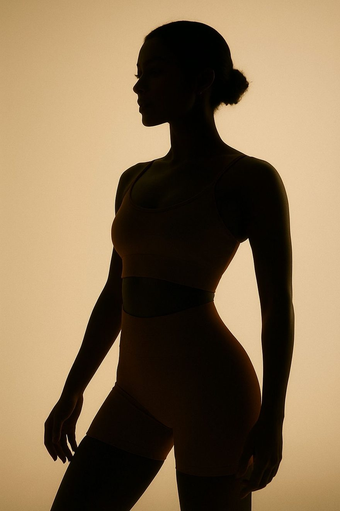
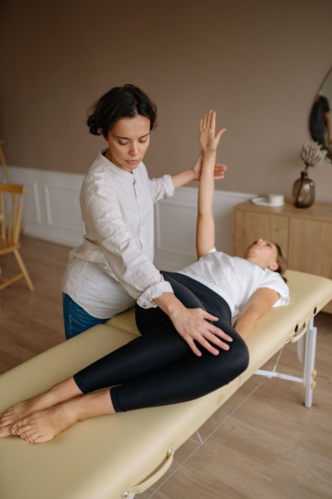

<!DOCTYPE html>
<html lang="es">
<head>
<meta charset="UTF-8">
<meta name="viewport" content="width=device-width, initial-scale=1">
<title>FISIO · Fisioterapia en Madrid Centro</title>
<link rel="icon" type="image/svg+xml" href="assets/favicon.svg">
<meta name="description" content="Centro de fisioterapia manual avanzada, ecografía, osteopatía y punción seca en el centro de Madrid. Pide cita por WhatsApp: 647 043 055.">
<link rel="preconnect" href="https://fonts.googleapis.com">
<link rel="preconnect" href="https://fonts.gstatic.com" crossorigin>
<link href="https://fonts.googleapis.com/css2?family=Plus+Jakarta+Sans:wght@500;600;700;800&family=Work+Sans:ital,wght@0,400;0,500;0,600;1,400&display=swap" rel="stylesheet">

</head>
<body>
<svg width="0" height="0" style="position:absolute" aria-hidden="true"><defs><symbol id="logoFT" viewBox="222 213 1116 658"><path fill="currentColor" d="M0 0 C11.8 5.2 21.1 12.3 30.2 21.4 C31.1 22.4 32.1 23.4 33.1 24.3 C34.2 25.4 35.2 26.5 36.3 27.6 C42.4 33.6 48.4 39.7 54.4 45.7 C58.1 49.4 61.7 53 65.4 56.7 C69.6 60.9 73.8 65.1 78 69.4 C78.7 70 78.7 70 82 73.3 C87.9 79.2 93.8 85 100.2 90.4 C103 93.2 105.7 96 108.4 98.8 C109.5 99.9 110.7 101.1 111.8 102.2 C112.9 103.4 114.1 104.6 115.2 105.8 C118.2 108.4 118.2 108.4 121.2 108.4 C121.6 107.6 121.6 107.6 123.5 103.2 C131.2 87.8 144.8 76.9 160.7 71.2 C177.5 66.1 195.1 67.2 210.9 75 C220.6 80.8 228.4 89.5 236.2 97.5 C238.2 99.4 238.2 99.4 240.2 100.4 C240.2 101.1 240.2 101.8 240.2 102.4 C241.5 103.1 242.8 103.8 244.2 104.4 C246.5 106.5 248.7 108.7 250.9 110.9 C252.3 112.3 253.6 113.6 255 115.1 C256.5 116.6 258 118.1 259.5 119.6 C261 121.1 262.6 122.6 264.1 124.1 C268.1 128.2 272.1 132.2 276.2 136.3 C280.2 140.4 284.3 144.5 288.4 148.6 C295.6 155.8 302.8 163 310 170.2 C312.7 173 315.5 175.7 318.2 178.4 C322.8 183 327.4 187.6 331.9 192.2 C332.7 192.9 333.4 193.7 334.2 194.4 C335.8 196.1 337.4 197.7 339 199.4 C341.2 201.4 341.2 201.4 345.2 203.4 C349.8 200.7 351 199.4 354.2 195.4 C354.8 194.9 354.8 194.9 357.7 192.3 C362.5 188.2 367 183.8 371.4 179.3 C372.3 178.4 373.2 177.5 374.1 176.6 C376 174.7 377.9 172.8 379.8 170.9 C382.9 167.8 385.9 164.8 388.9 161.8 C395.3 155.3 401.8 148.9 408.2 142.4 C415.6 135 423.1 127.5 430.5 120 C433.5 117 436.5 114.1 439.5 111.1 C441.3 109.2 443.1 107.4 445 105.6 C445.8 104.7 446.6 103.9 447.4 103.1 C452.2 98.3 457.1 93.9 462.2 89.4 C463.5 88 464.8 86.6 466.1 85.1 C477.7 73.4 493.4 68.5 509.5 68 C527.8 68.4 542.5 74.7 555.8 87.4 C561.8 93.8 565.9 100.2 569.2 108.4 C570.5 108.4 571.8 108.4 573.2 108.4 C573.7 107.6 573.7 107.6 576.2 103.4 C577.8 102.1 579.5 100.7 581.2 99.4 C582.9 97.8 584.5 96.1 586.2 94.4 C587.6 93 589.1 91.5 590.5 90.1 C591.2 89.4 591.9 88.6 592.6 87.9 C594.6 86 596.6 84.3 598.6 82.5 C606.4 75.7 613.5 68.1 620.8 60.7 C622 59.5 623.2 58.3 624.4 57.1 C625.4 56 626.5 54.9 627.6 53.8 C630.2 51.4 630.2 51.4 632.2 51.4 C632.8 50.1 633.5 48.8 634.2 47.4 C635.9 45.5 637.7 43.6 639.6 41.8 C640.6 40.7 641.7 39.7 642.8 38.6 C643.9 37.4 645 36.3 646.2 35.2 C646.7 34.6 646.7 34.6 649.6 31.8 C650.6 30.7 651.7 29.6 652.8 28.5 C653.8 27.6 654.8 26.6 655.8 25.6 C658.2 23.4 658.2 23.4 660.2 23.4 C660.8 22.1 661.5 20.8 662.2 19.4 C674.1 6.6 688.6 -1.5 706.2 -3 C724.4 -3.5 739.4 1 753.2 13.1 C760.9 20.5 766.8 28.1 770.2 38.4 C774.7 36.6 776.8 35.3 780.4 32.1 C785.4 27.9 790.2 25.1 796.2 22.4 C797.5 21.8 798.8 21.1 800.2 20.4 C818.3 15.7 835.9 16.7 852.5 25.8 C866.4 34.3 876.7 46.8 881.2 62.4 C881.5 63.1 881.5 63.1 882.9 66.4 C887.1 82.5 883.5 98.1 875.4 112.4 C874.3 113.7 873.3 115.1 872.2 116.4 C871.5 117.3 870.8 118.2 870.1 119.2 C866.5 123.7 863.1 127.5 858.7 131.3 C855.2 134.4 855.2 134.4 854.2 139.4 C855.5 139.8 856.8 140.2 858.1 140.6 C871.7 145.6 883.8 156.5 890.2 169.4 C890.4 169.9 890.4 169.9 891.7 172.2 C895.4 180.5 895.7 188.6 895.8 197.5 C895.8 198.7 895.8 199.8 895.8 201 C895.7 211.7 893.6 222 887.3 230.8 C887 231.3 887 231.3 885.2 233.8 C880.4 240.1 875.2 245.2 869.2 250.4 C864.1 255.3 859.2 260.2 854.6 265.6 C851 269.6 847.2 272.9 843 276.3 C842.7 276.6 842.7 276.6 841.2 278.4 C841.5 280.1 841.8 281.7 842.2 283.4 C844.6 285 844.6 285 847.8 286.4 C862.3 293.2 871.9 304.9 878.4 319.4 C883.8 334.7 882.9 354.1 876 368.6 C867.6 384.2 854.4 395.9 841.2 407.4 C839.8 409.1 838.5 410.8 837.2 412.4 C834.9 414.5 832.5 416.5 830.2 418.4 C828.5 420.1 826.8 421.8 825.2 423.4 C822.4 426.2 819.6 429 816.9 431.8 C816.2 432.5 815.4 433.3 814.7 434 C810 438.7 805.2 443.1 800.2 447.4 C798.8 449.1 797.5 450.8 796.2 452.4 C793.9 454.5 791.5 456.5 789.2 458.4 C787.5 460.1 785.8 461.8 784.2 463.4 C781.4 466.2 778.6 469 775.9 471.8 C775.2 472.5 774.4 473.3 773.7 474 C773.3 474.4 773.3 474.4 771.5 476.2 C771.2 476.5 771.2 476.5 769.6 478.2 C767.6 480.1 765.5 481.9 763.4 483.7 C759.3 487.3 755.5 491 751.7 494.9 C750.3 496.3 748.9 497.7 747.5 499.1 C746.1 500.5 744.6 502 743.2 503.4 C740.4 506.3 737.5 509.1 734.7 512 C733.4 513.3 732.2 514.5 730.9 515.8 C727.1 519.5 723.2 523 719.2 526.4 C716.6 529 714 531.5 711.5 534.1 C710.9 534.7 710.9 534.7 707.7 537.9 C706.5 539.1 705.4 540.2 704.2 541.4 C702.5 543.1 700.9 544.8 699.2 546.4 C698.1 547.5 697 548.6 695.9 549.7 C689.8 555.9 683.7 561.8 677.2 567.4 C675.7 568.9 674.3 570.3 672.9 571.8 C659.8 585 644 595.7 628.2 605.4 C627.2 606 626.3 606.6 625.3 607.3 C616.6 612.5 607.5 616.4 598.2 620.4 C596.7 621.1 595.3 621.8 593.8 622.5 C578.1 629.2 561.2 632.8 544.4 635.8 C542.1 636.3 539.8 636.7 537.6 637.2 C526.9 639.5 516.6 639.8 505.7 639.7 C504 639.7 502.4 639.7 500.7 639.7 C486.9 639.6 473.2 639.5 459.8 636.3 C456.8 635.6 453.9 635 450.9 634.5 C434.3 631.4 416.5 626.8 401.2 619.4 C400.1 618.9 398.9 618.4 397.8 617.8 C381.6 610 366.4 600.7 351.9 590.1 C348.8 588.2 346.8 587.7 343.2 587.4 C340.5 588.6 340.5 588.6 337.9 590.4 C337 591.1 336 591.7 335 592.4 C332.5 594.2 330 596 327.6 597.8 C287.1 626.3 237.6 639.6 188.6 639.7 C186.6 639.7 184.7 639.7 182.7 639.8 C171.5 639.8 161.2 638.9 150.2 636.4 C147.2 636 144.3 635.5 141.3 635.1 C108.6 629.6 74.8 616.4 48.2 596.4 C47.5 595.9 47.5 595.9 43.9 593.4 C34.7 586.8 26.2 580 18.1 572.2 C15.2 569.4 15.2 569.4 12.6 567.4 C9.9 565.2 7.6 562.9 5.2 560.4 C3.8 559.1 2.4 557.7 1 556.3 C-0.6 554.8 -2.1 553.3 -3.6 551.8 C-4 551.4 -4 551.4 -6 549.4 C-8 547.5 -9.9 545.5 -11.8 543.4 C-11.8 542.8 -11.8 542.1 -11.8 541.4 C-13.1 540.8 -14.5 540.1 -15.8 539.4 C-17.6 537.8 -19.3 536.2 -21 534.5 C-21.9 533.5 -22.9 532.5 -23.9 531.4 C-25 530.4 -26 529.3 -27.1 528.2 C-37.9 517.3 -37.9 517.3 -42.7 513.1 C-50.3 506.3 -57.4 498.9 -64.5 491.7 C-70.5 485.7 -76.4 479.9 -82.8 474.4 C-85.6 471.8 -88.3 469 -91 466.3 C-92.4 464.9 -93.7 463.6 -95.1 462.2 C-96.3 460.9 -97.6 459.7 -98.8 458.4 C-99.7 457.5 -100.6 456.6 -101.6 455.7 C-103.6 453.7 -105.6 451.6 -107.6 449.6 C-110.2 447 -112.8 444.6 -115.6 442.2 C-119.9 438.3 -124 434.3 -128.1 430.1 C-135.5 422.7 -135.5 422.7 -138.8 420.4 C-138.8 419.8 -138.8 419.1 -138.8 418.4 C-140.1 417.8 -141.5 417.1 -142.8 416.4 C-143 415.9 -143 415.9 -143.8 413.4 C-144.8 413.1 -145.8 412.8 -146.8 412.4 C-148.4 410.6 -150 408.8 -151.6 406.9 C-155.1 403 -159 399.6 -162.9 396.1 C-165.7 393.6 -168.2 391 -170.8 388.4 C-171.4 387.9 -171.4 387.9 -174.1 385.4 C-188.7 369.6 -191.5 353.3 -190.8 332.4 C-189.5 320.2 -184.5 310.9 -176.8 301.4 C-176.1 300.5 -175.3 299.5 -174.5 298.5 C-168.2 291.4 -159.4 286.3 -150.8 282.4 C-150.8 280.8 -150.8 279.1 -150.8 277.4 C-153.4 275.4 -156.1 273.4 -158.8 271.4 C-164.2 266.4 -169.4 261.1 -174.2 255.4 C-177.4 251.9 -180.6 248.9 -184.2 245.8 C-196.1 235 -204.3 221.1 -205.1 204.8 C-205.5 183.5 -202.1 168.9 -187.2 152.8 C-181.4 147.1 -172.3 139.4 -163.8 139.4 C-163.8 136.9 -163.8 136.9 -164.8 133.4 C-166.9 131.8 -169 130.1 -171.2 128.5 C-183.6 118.6 -190.9 103.8 -193.8 88.4 C-195.8 70.1 -189.9 54.6 -178.9 40.2 C-173.1 33.2 -167.1 28.2 -158.8 24.4 C-157.6 23.8 -156.5 23.1 -155.2 22.4 C-139.3 15.4 -123.2 16.7 -106.8 21.4 C-92.3 30.1 -92.3 30.1 -85.8 35.4 C-81.8 38.4 -81.8 38.4 -78.8 38.4 C-78.5 37 -78.2 35.6 -77.8 34.1 C-73.2 21.2 -61.6 10.1 -49.8 3.4 C-45.9 1.8 -41.9 0.7 -37.8 -0.6 C-26.6 -5 -11.3 -4.1 0 0 Z M678.8 50.4 C677.4 51.8 676.1 53.2 674.7 54.6 C672.2 57.1 669.8 59.6 667.3 62.2 C663.4 66.3 659.7 70 655.2 73.4 C655.2 74.1 655.2 74.8 655.2 75.4 C653.9 76.1 652.5 76.8 651.2 77.4 C648 80 645.1 82.7 642.2 85.4 C642.2 86.1 642.2 86.8 642.2 87.4 C640.9 88.1 639.5 88.8 638.2 89.4 C636.5 91.4 634.8 93.4 633.2 95.4 C632.4 96.1 631.6 96.7 630.8 97.3 C628.2 99.4 628.2 99.4 624.9 103.2 C621.2 107.4 621.2 107.4 616.8 111.3 C615.6 112.3 614.4 113.4 613.2 114.4 C613.2 115.1 613.2 115.8 613.2 116.4 C612.2 116.8 611.2 117.1 610.2 117.4 C607.8 120.1 605.5 122.7 603.2 125.4 C599.7 129.1 596 132.2 592.2 135.4 C589 138.4 586.2 141.5 583.4 144.8 C579.6 149.1 575.5 152.7 571.2 156.4 C570.2 157.6 569.2 158.7 568.2 159.9 C565.2 163.4 565.2 163.4 561.2 166.9 C557.1 170.5 553.7 174.3 550.2 178.4 C545.5 184 540.7 188.7 535.2 193.4 C532.4 196.2 529.6 199 526.9 201.8 C524.6 204.1 522.2 206.2 519.8 208.3 C516.2 211.4 516.2 211.4 514.2 213.9 C512.2 216.4 512.2 216.4 508.7 219.4 C503.4 224 498.5 229.1 493.6 234.1 C491.5 236.1 489.5 238.2 487.4 240.3 C484.2 243.5 481 246.7 477.9 249.9 C474.8 253.1 471.7 256.2 468.6 259.3 C467.6 260.3 466.7 261.3 465.7 262.3 C464.8 263.2 463.9 264.1 463 265 C462.6 265.4 462.6 265.4 460.6 267.4 C456.7 270.7 453.4 272.3 448.2 272.8 C442 272.2 438.5 270.9 434.3 266.2 C431.9 261.9 431 259.4 431.2 254.4 C434.5 245.4 440.3 239.9 447.2 233.4 C449.7 230.9 452.2 228.4 454.7 225.9 C457.1 223.5 459.6 221.5 462.2 219.4 C463.9 217.8 465.5 216.1 467.2 214.4 C469.3 212.5 471.3 210.6 473.4 208.7 C484 198.9 494.2 188.7 504.4 178.5 C507.8 175 511.3 171.6 514.7 168.2 C516.9 166 519.1 163.9 521.3 161.7 C521.8 161.2 521.8 161.2 524.4 158.6 C532.6 150.4 538.6 143 539.5 131.1 C538.8 120.7 534.6 113.8 527.3 106.6 C520 101.5 512.9 100.6 504.2 101.4 C495.7 103.7 488.3 108.3 483.2 115.4 C481.5 117.1 479.9 118.8 478.2 120.4 C477.3 121.4 476.3 122.3 475.4 123.3 C474.4 124.3 473.5 125.2 472.5 126.2 C471.5 127.2 470.6 128.1 469.6 129.1 C467.2 131.4 467.2 131.4 465.2 132.4 C465.2 133.1 465.2 133.8 465.2 134.4 C464.5 134.8 464.5 134.8 461.2 136.4 C459.2 138.6 457.2 140.8 455.3 143.1 C449.9 149.1 443.9 154.4 437.9 159.8 C437 160.7 436.1 161.5 435.2 162.4 C435.2 163.1 435.2 163.8 435.2 164.4 C434.2 164.8 433.2 165.1 432.2 165.4 C432.2 166.1 432.2 166.8 432.2 167.4 C431.5 167.8 431.5 167.8 428.2 169.4 C426.2 171.8 424.2 174.1 422.2 176.4 C420.2 178.1 418.2 179.8 416.2 181.4 C416.2 182.1 416.2 182.8 416.2 183.4 C415.5 183.8 415.5 183.8 412.2 185.4 C411.6 186.2 411 186.9 410.4 187.6 C407.4 191.4 403.8 194.3 400.2 197.4 C398.5 199 396.8 200.7 395.2 202.4 C395.2 203.1 395.2 203.8 395.2 204.4 C394.2 204.8 393.2 205.1 392.2 205.4 C392.2 206.1 392.2 206.8 392.2 207.4 C391.5 207.4 390.9 207.4 390.2 207.4 C388.5 209.1 386.8 210.7 385.2 212.4 C382.1 215.2 379 218 375.9 220.8 C373.2 223.4 373.2 223.4 370.2 227.4 C371.3 234.4 376.8 238.9 381.4 243.9 C405.2 272.4 422 308.5 428.5 345 C429.2 348.4 429.2 348.4 430.2 350.4 C435.8 349 437.5 345.8 441.2 341.4 C445.9 336.5 450.7 332.4 456.2 328.4 C457.7 327.3 459.2 326.2 460.7 325.1 C474.7 315.3 490.7 309.5 507.2 305.4 C508.9 305 510.6 304.6 512.3 304.1 C516.2 303.4 516.2 303.4 521.2 304.4 C528.2 318 529.9 333.6 529.8 348.7 C529.8 350.2 529.8 351.7 529.8 353.3 C529.6 365.6 527.6 375.9 523.2 387.4 C522.8 388.6 522.4 389.8 522 391 C520.5 395.2 518.8 399.3 517.2 403.4 C517.5 403.9 517.5 403.9 519.2 406.4 C522.9 406.1 526.5 405.8 530.2 405.5 C531.2 405.4 532.2 405.3 533.3 405.2 C537.7 404.9 542.1 404.5 546.4 403.9 C571.8 400.9 598.8 405.4 623.2 412.4 C624.2 413.4 624.2 413.4 624.4 416.2 C624.1 422.2 622.5 427.8 621 433.6 C620.7 434.7 620.4 435.9 620.1 437 C612 468.1 595.6 496.7 574.2 520.4 C573.3 521.4 572.5 522.4 571.6 523.3 C543.8 554.6 505.6 578.3 464.7 587.6 C461.6 588.3 458.6 589.2 455.6 590.1 C450 591.5 444.8 591.9 439.1 592 C438.1 592.2 437.2 592.3 436.2 592.4 C435.5 593.4 434.9 594.4 434.2 595.4 C465 609.5 511.7 612.2 544.2 602.4 C545.9 602.1 547.7 601.8 549.5 601.5 C554.9 600.5 560 599.1 565.2 597.4 C566.3 597.1 567.4 596.9 568.6 596.6 C573.9 594.9 579 592.7 584.2 590.4 C585.6 589.9 586.9 589.3 588.3 588.7 C607.8 580.4 626.3 569.1 641.8 554.6 C644.4 552.3 647.1 550.1 649.8 548 C651.3 546.8 652.7 545.6 654.2 544.4 C654.2 543.8 654.2 543.1 654.2 542.4 C655.5 541.8 656.8 541.1 658.2 540.4 C660 538.8 661.7 537.1 663.4 535.4 C664.4 534.4 665.4 533.4 666.5 532.3 C667.5 531.3 668.6 530.2 669.6 529.1 C670.1 528.6 670.1 528.6 672.8 526 C674.7 524 676.6 522 678.6 520.1 C681.1 517.5 683.6 515 686.2 512.4 C687.2 511.4 688.1 510.5 689.2 509.4 C689.7 508.9 689.7 508.9 692.2 506.3 C693.3 505.3 694.3 504.2 695.3 503.2 C698.2 500.4 698.2 500.4 702.2 497.4 C702.2 496.8 702.2 496.1 702.2 495.4 C702.8 495.4 703.5 495.4 704.2 495.4 C705.2 494.3 706.2 493.1 707.2 491.9 C710 488.8 712.5 486.2 715.7 483.4 C718.6 480.9 721 478.5 723.6 475.5 C729 469.4 735.2 464.2 741.4 458.9 C745.3 455.3 748.7 451.5 752.2 447.4 C758.8 440.7 758.8 440.7 761.2 439.4 C761.2 438.8 761.2 438.1 761.2 437.4 C762.5 436.8 763.8 436.1 765.2 435.4 C766.9 433.4 768.5 431.4 770.2 429.4 C772.8 427.1 775.5 424.7 778.2 422.4 C783.7 417.7 788.8 412.9 793.9 407.8 C794.6 407.1 795.3 406.4 796 405.6 C798.3 403.4 800.5 401.2 802.7 398.9 C805.6 396 808.5 393 811.5 390.1 C812.8 388.8 814 387.5 815.4 386.2 C819.2 382.4 823.2 378.9 827.2 375.4 C829.6 373.2 832 370.8 834.4 368.5 C835.5 367.4 836.7 366.2 837.9 365 C844.4 358 848 350.9 849.2 341.4 C848.1 331.1 843 323.1 835.2 316.4 C827.7 312 820.7 311.2 812.2 312.4 C803.4 315.4 796 320.7 790.2 327.9 C787.3 331.6 783.7 334.4 780.2 337.4 C772.5 344.7 772.5 344.7 769.2 348.4 C769.2 349.1 769.2 349.8 769.2 350.4 C767.9 351.1 766.5 351.8 765.2 352.4 C763.5 354.1 761.8 355.7 760.2 357.4 C740.2 377.4 740.2 377.4 737.7 379.9 C735 382.6 732.4 385.3 729.7 388 C727.6 390.2 725.4 392.3 723.3 394.5 C722.8 395 722.8 395 720.1 397.8 C719.1 398.8 718 399.9 716.9 401 C716 401.9 715.1 402.9 714.1 403.9 C709.4 408 704.6 411.2 698.2 411.4 C692.7 410.5 689.6 408.9 686.2 404.4 C683.8 398.9 684.1 394.3 685.2 388.4 C687.9 383.9 690.3 381.1 694 377.4 C695.1 376.3 696.3 375.2 697.4 374 C698.6 372.8 699.8 371.6 701.1 370.4 C702.2 369.3 703.4 368.1 704.7 366.9 C706.9 364.7 709.1 362.5 711.3 360.3 C715.4 356.2 719.5 352.1 723.6 348 C725.3 346.3 727 344.6 728.6 342.9 C729.5 342.1 730.3 341.3 731.2 340.4 C735.3 336.2 739.6 332.2 744.2 328.4 C746.5 325.8 748.9 323.1 751.2 320.4 C755.6 315.9 760 311.5 764.8 307.3 C769.4 303.3 773.8 299 778.1 294.7 C779 293.8 779.8 293 780.7 292.1 C783.5 289.3 786.3 286.5 789.1 283.7 C791 281.8 793 279.8 794.9 277.9 C799 273.8 803.1 269.7 807.2 265.6 C812.4 260.4 817.6 255.2 822.9 250 C826.9 246 830.9 241.9 834.9 237.9 C836.9 236 838.8 234.1 840.7 232.2 C843.4 229.5 846.1 226.8 848.8 224.1 C849.6 223.3 850.4 222.5 851.2 221.7 C859 213.8 862.3 208.7 862.4 197.5 C862.4 196.3 862.4 195.1 862.4 193.9 C861.9 186.6 859 182 854.2 176.4 C845.5 170 840 167.9 829.2 168.4 C815.8 170.5 805.3 183.1 796.2 192.4 C794.5 194.1 792.9 195.8 791.2 197.4 C789.5 199.1 787.8 200.8 786.2 202.5 C784.2 204.4 782.3 206.4 780.4 208.3 C779.4 209.3 778.5 210.2 777.5 211.2 C773.4 215.3 769.3 219.3 765 223.1 C760.8 226.8 757 230.8 753.2 234.9 C748.1 240.5 742.9 245.6 737.2 250.4 C734.9 252.5 732.7 254.5 730.4 256.6 C729.3 257.6 728.3 258.5 727.1 259.6 C724.6 262.1 722.4 264.6 720.2 267.4 C717.6 270.1 715.1 272.5 712.2 274.9 C709.2 277.4 709.2 277.4 706.8 280.3 C703.6 284.1 700 287.2 696.2 290.4 C695.2 291.4 694.2 292.4 693.2 293.4 C693.2 294.1 693.2 294.8 693.2 295.4 C692.2 295.8 691.2 296.1 690.2 296.4 C688.5 298.1 686.8 299.7 685.2 301.4 C684.3 302.3 683.3 303.2 682.4 304.1 C680.2 306.4 680.2 306.4 680.2 308.4 C678.9 309.1 677.5 309.8 676.2 310.4 C673.7 312.8 671.2 315.2 668.8 317.7 C667.5 319 666.2 320.3 664.8 321.6 C661.8 324.8 659 328.1 656.2 331.4 C653.6 333.8 650.9 336.1 648.2 338.4 C646.9 339.6 645.6 340.7 644.3 341.8 C640.1 345.4 638.3 345.6 632.9 345.7 C631.7 345.7 630.6 345.7 629.4 345.8 C626.2 345.4 626.2 345.4 621.2 342.4 C617.8 337.7 616.3 334.3 617.2 328.4 C619.9 321.8 622.4 317.6 628.2 313.4 C631.4 310.4 634.3 307.2 637.2 303.9 C644.1 296.3 651.2 288.8 659.1 282.1 C662.8 278.9 665.9 275.2 669.2 271.4 C672.9 267.7 676.5 264 680.5 260.6 C687.2 254.8 693.3 248.4 699.6 242.1 C700.9 240.8 702.3 239.4 703.7 238 C707.4 234.3 711 230.7 714.6 227 C718.3 223.3 722 219.6 725.7 215.9 C732.2 209.4 738.7 202.9 745.2 196.4 C747.1 194.5 748.9 192.7 750.8 190.9 C753.2 188.4 755.7 185.9 758.2 183.4 C763.5 178 768.9 172.6 774.3 167.2 C776.6 164.9 779 162.5 781.3 160.2 C784.6 156.8 788 153.5 791.4 150.1 C791.9 149.6 791.9 149.6 794.4 147 C800.1 141.3 805.9 136.1 812.2 131.2 C812.9 130.6 813.5 130 814.2 129.4 C814.2 128.8 814.2 128.1 814.2 127.4 C814.8 127.4 815.5 127.4 816.2 127.4 C817.7 125.6 819.3 123.9 820.8 122.1 C823.8 118.8 826.9 115.9 830.2 112.9 C849.5 95.2 849.5 95.2 850.5 84.4 C850.7 74.4 848.8 69.1 843.4 60.7 C838.6 55.8 833.2 51.7 826.2 51.4 C824.4 51.4 822.7 51.3 820.9 51.2 C813.1 51.5 807.8 53.4 801.2 57.4 C798.8 60.1 796.5 62.8 794.2 65.4 C791.5 68 788.8 70.6 786.1 73.1 C779.5 79.2 773.2 85.5 767.2 92.3 C764.2 95.4 764.2 95.4 760.5 98.7 C756.4 102.2 752.7 105.9 748.9 109.6 C747.6 111 746.3 112.3 744.9 113.7 C744.2 114.4 744.2 114.4 740.8 117.8 C738.1 120.6 735.4 123.3 732.7 126 C732.1 126.6 732.1 126.6 729 129.7 C726.2 132.4 726.2 132.4 724.2 133.4 C724.2 134.1 724.2 134.8 724.2 135.4 C723.5 135.8 723.5 135.8 720.2 137.4 C718.2 139.2 716.3 141.1 714.4 143 C713.2 144.2 712.1 145.3 710.9 146.5 C709.6 147.8 708.4 149.1 707.1 150.4 C705.8 151.7 704.5 153 703.2 154.3 C699 158.4 694.9 162.6 690.8 166.8 C688 169.5 685.2 172.3 682.4 175.1 C676.3 181.3 670.1 187.4 664 193.6 C661.4 196.2 658.8 198.8 656.2 201.4 C654.8 202.9 653.3 204.3 651.9 205.7 C647.4 210.3 642.8 214.8 638.3 219.4 C636.4 221.3 634.4 223.3 632.5 225.2 C629.6 228.1 626.8 230.9 624 233.7 C623.1 234.6 622.3 235.5 621.4 236.4 C616.5 241.3 611.4 245.9 606.2 250.4 C605.5 251.3 604.9 252.1 604.2 252.9 C601.3 256.6 597.7 259.4 594.2 262.4 C592.7 263.9 591.1 265.5 589.6 267 C586 270.7 582.2 274.1 578.2 277.4 C577.2 278.4 576.2 279.4 575.2 280.4 C572 280.8 572 280.8 568.3 280.8 C567.1 280.8 565.9 280.8 564.6 280.8 C561.2 280.4 561.2 280.4 556.2 277.4 C552.2 272.1 551.4 268.1 552.2 261.4 C555.5 254.5 560.7 249.7 566.2 244.4 C567.9 242.8 569.5 241.1 571.2 239.4 C572.6 238 574 236.6 575.4 235.2 C576.2 234.4 577 233.6 577.8 232.8 C630.2 180.4 630.2 180.4 632.9 177.7 C635.2 175.4 637.5 173.1 639.7 170.9 C641.4 169.2 643.1 167.5 644.8 165.8 C645.7 164.9 646.5 164 647.4 163.1 C653.8 156.7 653.8 156.7 657.2 154.4 C657.2 153.8 657.2 153.1 657.2 152.4 C658.5 151.8 659.8 151.1 661.2 150.4 C661.9 149.6 662.5 148.7 663.2 147.9 C665.9 144.8 668.4 142.6 671.5 140.1 C677.8 135 683.3 129.6 688.6 123.6 C694.2 117.1 700.3 111 706.8 105.4 C707.9 104.4 709 103.5 710.2 102.4 C710.2 101.8 710.2 101.1 710.2 100.4 C711.5 99.8 712.8 99.1 714.2 98.4 C714.2 97.8 714.2 97.1 714.2 96.4 C715.5 95.8 716.8 95.1 718.2 94.4 C722.5 90.3 726.5 86.1 730.2 81.4 C730.6 81.1 730.6 81.1 732.6 79.2 C738.6 72.7 741.3 65.3 741.2 56.4 C738.8 47.2 734.8 40 726.6 34.8 C705.9 24.2 692.8 35.7 678.8 50.4 Z M-40.5 38.2 C-45.7 43.4 -49.7 49.1 -50.8 56.4 C-50.5 68.6 -46.1 76 -37.8 84.4 C-37.2 84.4 -36.5 84.4 -35.8 84.4 C-35.5 85.1 -35.5 85.1 -33.8 88.4 C-31.3 91.2 -31.3 91.2 -28.8 93.4 C-28.2 93.4 -27.5 93.4 -26.8 93.4 C-26.2 94.8 -25.5 96.1 -24.8 97.4 C-20.4 102.4 -15.5 106.8 -10.5 111.2 C-7.2 114.1 -4.6 117.1 -1.8 120.4 C-1.2 120.4 -0.5 120.4 0.2 120.4 C0.8 121.8 1.5 123.1 2.2 124.4 C4.8 127.1 7.5 129.8 10.2 132.4 C10.6 132.8 10.6 132.8 12.5 134.8 C16.7 138.9 21.3 142.6 25.8 146.4 C29 149.2 31.5 152.1 34.2 155.4 C37.7 159.1 41.3 162.4 45.1 165.8 C49.8 170.1 54 174.6 58.2 179.4 C60.8 181.8 63.5 184.1 66.2 186.4 C67.5 188.1 68.9 189.8 70.2 191.4 C71.3 192.4 72.5 193.4 73.7 194.5 C78.7 198.9 83.5 203.6 88.2 208.4 C89.1 209.3 90.1 210.2 91 211.2 C94 214.1 96.9 217.1 99.9 220.1 C101.9 222.1 103.9 224.1 105.9 226.1 C109.5 229.7 113.2 233.4 116.8 237 C117.6 237.8 118.3 238.6 119.1 239.4 C120.8 241 122.4 242.7 124 244.3 C126.1 246.3 128.2 248.3 130.2 250.2 C135.1 255.4 137.8 259.4 138.7 266.5 C138.1 271.1 136.9 273.7 134.2 277.4 C127.9 281.2 123.4 281.7 116.2 280.4 C112.1 277.9 109.5 275.8 106.2 272.4 C105.6 271.8 105.6 271.8 102.4 268.7 C99.8 266.1 97.2 263.5 94.6 260.8 C91.9 258.1 89.2 255.8 86.2 253.4 C85.1 252.2 84 250.9 82.9 249.6 C79.2 245.4 79.2 245.4 75.6 242.3 C70.4 237.7 65.5 232.9 60.6 228 C59.6 226.9 58.6 225.9 57.5 224.9 C55.3 222.6 53.1 220.4 50.9 218.2 C47.4 214.7 43.9 211.2 40.4 207.6 C30.4 197.6 20.4 187.6 10.5 177.6 C4.4 171.5 -1.7 165.4 -7.8 159.3 C-10.1 156.9 -12.5 154.6 -14.8 152.3 C-18 149 -21.3 145.8 -24.5 142.5 C-25.5 141.5 -26.4 140.6 -27.4 139.6 C-31.7 135.3 -35.7 131.6 -40.8 128.4 C-42.5 126.5 -44.2 124.5 -45.8 122.4 C-46.9 121.5 -48 120.5 -49.2 119.6 C-53.2 116.1 -56.4 112.4 -59.8 108.4 C-62.7 105.3 -65.7 102.4 -68.8 99.4 C-69.5 99.4 -70.1 99.4 -70.8 99.4 C-71.1 98.4 -71.5 97.5 -71.8 96.4 C-72.5 95.9 -73.2 95.3 -73.9 94.8 C-77.7 91.7 -80.6 88.1 -83.8 84.4 C-86.7 81.3 -89.7 78.4 -92.8 75.4 C-93.5 75.4 -94.1 75.4 -94.8 75.4 C-95.1 74.4 -95.5 73.5 -95.8 72.4 C-98.5 70.1 -101.1 67.7 -103.8 65.4 C-105.3 63.9 -106.9 62.3 -108.4 60.8 C-115.1 53.9 -120.9 51.6 -130.6 51.2 C-138.7 51.3 -144.5 52.9 -150.6 58.5 C-157.7 66.2 -160.7 73.6 -160.3 84 C-159 93.5 -153.5 99.1 -146.8 105.4 C-146.1 106.3 -145.4 107.3 -144.6 108.2 C-142.8 110.4 -142.8 110.4 -140.5 112.2 C-137.8 114.4 -137.8 114.4 -134.2 118.6 C-130.8 122.4 -130.8 122.4 -126.8 124.4 C-126.2 125.8 -125.5 127.1 -124.8 128.4 C-122.6 130.4 -122.6 130.4 -119.9 132.4 C-104 145.1 -104 145.1 -100.8 151.4 C-100.2 151.4 -99.5 151.4 -98.8 151.4 C-98.8 152.1 -98.8 152.8 -98.8 153.4 C-97 155.1 -95.1 156.7 -93.2 158.4 C-89 162 -85.1 166 -81.2 169.9 C-80.3 170.9 -79.4 171.8 -78.4 172.7 C-76.4 174.7 -74.4 176.7 -72.4 178.7 C-69.3 181.9 -66.1 185.1 -62.9 188.3 C-55.1 196.1 -47.2 204 -39.4 211.9 C-32.8 218.5 -26.1 225.2 -19.5 231.8 C-16.4 235 -13.3 238.1 -10.2 241.2 C-8.2 243.1 -6.3 245 -4.4 246.9 C-4 247.4 -4 247.4 -1.8 249.6 C3 254.4 8 258.9 13.2 263.4 C14.5 265.1 15.9 266.8 17.2 268.4 C19.2 270.1 21.2 271.8 23.2 273.4 C26 276.1 28.5 278.8 31 281.8 C34.5 285.8 38.2 289 42.2 292.4 C46.4 296.5 50.5 300.6 54.2 305.1 C57.2 308.4 57.2 308.4 61.1 311.8 C66.9 317 72.8 322.6 73.6 330.6 C73.1 336.3 71.6 339 68.2 343.4 C62.2 346.4 56.7 346.6 50.2 345.4 C46.2 343 43.3 339.9 40.2 336.4 C39.1 335.6 38.1 334.7 37 333.9 C34.2 331.5 31.9 328.8 29.5 326 C22.6 318.4 15.3 311 7.5 304.3 C4.6 301.8 2.5 299.4 0.2 296.4 C-0.5 296.4 -1.1 296.4 -1.8 296.4 C-2.5 295.1 -3.1 293.8 -3.8 292.4 C-4.5 292.4 -5.1 292.4 -5.8 292.4 C-6.5 291.1 -7.1 289.8 -7.8 288.4 C-8.8 287.4 -9.8 286.5 -10.8 285.4 C-11.5 285.4 -12.1 285.4 -12.8 285.4 C-13.5 284.1 -14.1 282.8 -14.8 281.4 C-17.4 279.1 -20.1 276.7 -22.8 274.4 C-26.4 271 -29.6 267.3 -32.8 263.4 C-36.3 259.8 -39.9 256.6 -43.8 253.4 C-47.7 250.3 -51.3 247 -54.8 243.4 C-55.5 242.8 -55.5 242.8 -58.8 239.6 C-62.8 235.4 -62.8 235.4 -65.8 231.9 C-68.8 228.4 -68.8 228.4 -72.4 225.3 C-77.2 221.1 -81.6 216.8 -86 212.3 C-86.8 211.5 -87.6 210.7 -88.4 209.9 C-90.5 207.8 -92.7 205.6 -94.8 203.4 C-95.6 202.6 -96.4 201.8 -97.3 201 C-99.6 198.6 -102 196.2 -104.3 193.9 C-106 192.1 -107.7 190.4 -109.4 188.6 C-110.3 187.8 -111.1 186.9 -112 186 C-121 176.8 -129.4 169 -142.7 168.1 C-152.5 168.7 -158.5 172 -165.8 178.4 C-170.8 184.6 -172 188.9 -172 196.8 C-172 198 -172 199.3 -172 200.6 C-171.6 207.6 -170 211.9 -165.1 216.9 C-164.1 218 -163.1 219 -162.1 220.1 C-161 221.2 -159.9 222.3 -158.8 223.4 C-158.3 224 -158.3 224 -155.4 226.9 C-151.6 230.8 -147.8 234.6 -144 238.4 C-142.6 239.8 -141.3 241.2 -139.9 242.6 C-137 245.5 -134.1 248.4 -131.2 251.3 C-127.5 255 -123.8 258.7 -120 262.4 C-116.5 266 -113 269.5 -109.4 273.1 C-108.1 274.4 -106.7 275.8 -105.4 277.1 C-104.1 278.4 -102.9 279.6 -101.6 280.8 C-100.6 281.9 -99.5 283 -98.4 284.1 C-95.8 286.4 -95.8 286.4 -93.8 286.4 C-93.8 287.1 -93.8 287.8 -93.8 288.4 C-93.2 288.4 -92.5 288.4 -91.8 288.4 C-91.2 289.8 -90.5 291.1 -89.8 292.4 C-87.2 295.2 -84.6 297.9 -81.8 300.4 C-81.2 300.4 -80.5 300.4 -79.8 300.4 C-79.2 301.8 -78.5 303.1 -77.8 304.4 C-75.3 306.9 -72.7 309.4 -70.1 311.8 C-56.4 324.3 -56.4 324.3 -52.9 328.9 C-50.6 331.7 -47.9 333.9 -45.2 336.3 C-37.2 343.4 -29.8 351.1 -22.2 358.7 C-20 360.9 -17.8 363 -15.6 365.2 C-12.4 368.4 -9.2 371.5 -6 374.7 C-5 375.7 -4 376.7 -3 377.7 C-2.1 378.6 -1.2 379.5 -0.2 380.4 C0.6 381.2 1.4 382 2.2 382.9 C5.9 387.6 6.2 391.7 5.9 397.6 C5.1 402.7 4.5 405.4 0.5 408.6 C-5 411.6 -8.2 411.9 -14.3 410.2 C-21.6 407.1 -26.6 401.4 -32 395.8 C-32.6 395.2 -32.6 395.2 -35.4 392.4 C-39 388.7 -42.6 385.1 -46.1 381.4 C-49.7 377.8 -53.3 374.2 -56.9 370.5 C-59.1 368.3 -61.4 366 -63.6 363.7 C-64.6 362.7 -65.6 361.7 -66.6 360.6 C-67.5 359.7 -68.4 358.8 -69.3 357.9 C-71.8 355.4 -71.8 355.4 -74.4 353.3 C-78 350.5 -80.8 346.9 -83.8 343.4 C-89.2 337.8 -94.8 332.4 -100.8 327.4 C-101.3 326.8 -101.3 326.8 -103.8 323.4 C-104.5 323.4 -105.1 323.4 -105.8 323.4 C-105.8 322.8 -105.8 322.1 -105.8 321.4 C-107.7 320 -109.6 318.7 -111.6 317.4 C-112.6 316.7 -113.7 315.9 -114.8 315.2 C-121 311.6 -127.8 311.6 -134.8 312.4 C-145 315.6 -151.8 321.8 -156.8 331.2 C-158.7 339.2 -158.8 345.9 -155.9 353.6 C-152.3 359.2 -148.4 363.7 -143.8 368.4 C-142.8 369.5 -141.7 370.6 -140.6 371.7 C-134.9 377.5 -129 383.1 -122.8 388.4 C-120.2 391.1 -117.5 393.8 -114.9 396.5 C-112.8 398.4 -112.8 398.4 -110.8 398.4 C-110.5 399.1 -110.5 399.1 -108.8 402.4 C-107.3 404.1 -105.8 405.7 -104.2 407.3 C-103.7 407.8 -103.7 407.8 -101.4 410.1 C-100.5 411.1 -99.5 412 -98.5 413 C-97.5 414 -96.6 414.9 -95.6 415.9 C-95.2 416.4 -95.2 416.4 -92.8 418.7 C-92 419.5 -91.1 420.4 -90.3 421.2 C-87.8 423.4 -87.8 423.4 -82.8 426.4 C-81.2 428.3 -79.6 430.1 -78 432 C-75.3 435 -72.3 437.7 -69.2 440.5 C-64.8 444.6 -60.7 448.7 -56.8 453.4 C-51 459.6 -44.6 465.1 -38.1 470.5 C-34.8 473.4 -34.8 473.4 -31.7 477.1 C-27.4 481.9 -22.7 486.2 -17.9 490.6 C-14.6 493.7 -11.7 497 -8.8 500.4 C-8.2 500.4 -7.5 500.4 -6.8 500.4 C-6.8 501.1 -6.8 501.8 -6.8 502.4 C-4.2 504.8 -1.5 507.1 1.2 509.4 C3.7 511.9 6.2 514.4 8.7 516.9 C10.1 518.3 11.5 519.7 12.9 521.1 C15 523.3 17.2 525.4 19.4 527.6 C21.5 529.8 23.6 531.9 25.7 534 C26.3 534.6 26.3 534.6 29.5 537.8 C33.3 541.5 37.2 545 41.2 548.4 C42.8 549.9 44.4 551.4 46.1 552.9 C74.7 578.6 111 597.3 149.2 603.4 C150.2 603.6 151.3 603.8 152.4 604 C186.6 609.5 222.2 607.3 255.2 596.4 C255.2 595.4 255.2 594.5 255.2 593.4 C252.3 592 249.7 592.2 246.6 592.1 C238.1 591.6 230.3 589.8 222.2 587.4 C220.5 586.9 218.8 586.4 217 585.9 C190.3 577.8 164.7 565.4 143.2 547.4 C141.8 546.3 140.4 545.2 138.9 544 C128.7 535.7 120.1 527.9 112.2 517.4 C111.5 517.4 110.9 517.4 110.2 517.4 C109.5 515.8 108.9 514.1 108.2 512.4 C106.3 510.3 104.3 508.3 102.4 506.2 C99 502 96.6 497.5 94.1 492.8 C92.2 489.4 92.2 489.4 89 484.8 C85.8 479.9 83.5 474.8 81.2 469.4 C80.4 467.8 79.6 466.1 78.8 464.3 C76.2 458.5 74 452.6 72.1 446.6 C71.7 445.5 71.4 444.5 71 443.4 C64 421.9 64 421.9 65.2 414.4 C76.6 405.9 96.4 405.6 110.2 404.4 C111.5 404.3 112.8 404.1 114.2 403.9 C130.6 402 147 404.2 163.3 406.2 C166.2 406.4 166.2 406.4 171.2 406.4 C171.5 406.1 171.8 405.8 172.2 405.4 C171.6 398.4 169.1 392 166.7 385.4 C165 379.9 164 374.6 163 369 C162.7 367.1 162.3 365.1 162 363.1 C160.5 352.3 161.7 342.6 163.4 331.9 C163.6 330.6 163.8 329.2 164.1 327.8 C165.3 320.2 167 313.5 170.2 306.4 C193.4 309.5 215.9 316.2 234.2 331.4 C237 333.5 239.8 335.5 242.6 337.5 C246.9 340.7 250.3 343.6 253.8 347.7 C254.9 348.9 256 350.2 257.2 351.4 C258.2 351.4 259.2 351.4 260.2 351.4 C261.2 349.4 261.2 349.4 261.6 344.3 C262.1 338.9 263.2 335.4 265.2 330.4 C265.6 328.6 266.1 326.7 266.6 324.8 C274.2 293.3 292.8 262.7 313.9 238.3 C314.7 237.4 315.5 236.4 316.4 235.4 C317.1 234.6 317.9 233.7 318.7 232.9 C320.2 230.4 320.2 230.4 319.2 225.4 C314.1 219.1 307.7 214.2 301.2 209.4 C300.9 208.8 300.5 208.1 300.2 207.4 C299.5 207.4 298.9 207.4 298.2 207.4 C297.5 206.1 296.9 204.8 296.2 203.4 C291.9 198.7 287.2 194.4 282.2 190.4 C281.2 189.1 280.2 187.8 279.2 186.4 C278.5 186.4 277.9 186.4 277.2 186.4 C276.5 185.1 275.9 183.8 275.2 182.4 C272.6 180.1 269.9 177.7 267.2 175.4 C263.5 171.9 260.1 168.1 256.6 164.3 C251.7 158.9 246.5 154 241.1 149.2 C237.2 145.5 233.7 141.5 230.1 137.5 C229.5 136.8 228.9 136.1 228.2 135.4 C227.5 135.4 226.9 135.4 226.2 135.4 C226.2 134.8 226.2 134.1 226.2 133.4 C223.5 131.1 220.9 128.7 218.2 126.4 C214.9 123.3 211.8 120.2 208.9 116.6 C202.5 109.2 194.7 102.1 184.7 101.1 C174 100.7 168.4 103.2 159.9 109.8 C153.7 115.9 151.5 121.9 150.9 130.6 C151.5 139.7 153.9 145.5 160.1 152 C161.1 153 162 154.1 163.1 155.2 C168.3 160.6 173.5 165.9 178.8 171.2 C179.4 171.8 179.4 171.8 182.4 174.8 C184.8 177.2 187.3 179.7 189.7 182.1 C193.4 185.9 197.2 189.6 200.9 193.4 C203.3 195.8 205.7 198.2 208.1 200.6 C208.6 201.1 208.6 201.1 211.4 203.9 C216.5 208.9 221.3 213.5 227.2 217.4 C228.9 219.1 230.6 220.7 232.2 222.4 C234 224.2 235.8 225.9 237.6 227.7 C239.6 229.7 241.7 231.7 243.8 233.8 C244.8 234.8 245.8 235.8 246.9 236.8 C256.7 246.5 256.7 246.5 259.2 253.4 C259.2 260.3 258.1 262.8 254.2 268.4 C248.6 272.3 245.8 273.7 239.1 272.7 C229.3 268.2 222.2 259.6 214.8 252 C212.6 249.8 210.4 247.6 208.2 245.4 C204.7 241.9 201.3 238.5 197.8 235 C194.5 231.6 191.2 228.3 187.8 224.9 C186.8 223.9 185.7 222.8 184.7 221.7 C183.7 220.8 182.8 219.8 181.8 218.8 C181.4 218.4 181.4 218.4 179.2 216.3 C177.2 214.4 177.2 214.4 175.2 214.4 C174.5 213.1 173.9 211.8 173.2 210.4 C171.2 208.5 169.2 206.6 167.2 204.7 C166.1 203.7 165 202.7 163.9 201.7 C161.2 199.4 161.2 199.4 159.2 199.4 C158.9 198.4 158.5 197.5 158.2 196.4 C156.5 195.1 154.9 193.7 153.2 192.4 C151.5 190.8 149.8 189.1 148.2 187.4 C147.4 186.7 146.7 186 145.9 185.2 C141.1 180.3 136.6 175.1 132 170 C128.5 166 125 162.1 121.2 158.4 C120.3 157.5 119.4 156.6 118.5 155.6 C116.2 153.4 116.2 153.4 114.2 153.4 C113.5 152.1 112.9 150.8 112.2 149.4 C110.6 147.7 108.9 146.1 107.2 144.4 C106.3 143.5 105.3 142.5 104.4 141.6 C99.9 137.1 95.5 132.7 90.7 128.5 C87.7 125.9 85.5 123.5 83.2 120.4 C81.5 118.7 79.9 117.1 78.2 115.4 C71.2 108.4 71.2 108.4 68.7 105.9 C66.2 103.4 66.2 103.4 62.8 100.6 C59.2 97.4 59.2 97.4 55.9 93.6 C50.5 87.5 44.3 82.3 38.1 76.9 C32.8 72.2 27.5 67.4 23.1 61.8 C21.2 59.4 21.2 59.4 17.6 56.3 C11.8 51.2 6.6 45.7 1.4 40.2 C-11.3 28.9 -27.4 26.8 -40.5 38.2 Z M340.9 256.4 C328.2 270.7 318.3 285.5 310.4 302.8 C308.9 306 307.3 309.1 305.6 312.1 C285.3 348.7 285.1 395.2 291.2 435.4 C291.8 437.4 292.5 439.4 293.2 441.4 C293.5 443.1 293.8 444.8 294.1 446.6 C295.2 452.6 297 458.1 299.2 463.8 C299.6 464.8 300 465.9 300.4 466.9 C308 486.6 317.4 505.3 330.3 522 C331.7 523.8 333 525.6 334.2 527.4 C334.8 527.4 335.5 527.4 336.2 527.4 C336.5 528.1 336.5 528.1 338.2 531.4 C339.9 534.2 339.9 534.2 342.2 536.4 C348.2 536.4 348.2 536.4 350.5 534.3 C351.2 533.4 351.9 532.5 352.6 531.5 C353.4 530.5 354.2 529.5 355 528.4 C355.3 527.9 355.3 527.9 357.2 525.4 C358.3 524 359.5 522.6 360.7 521.1 C373.9 503.4 383.4 484.1 391.2 463.4 C391.6 462.4 392 461.3 392.5 460.2 C394.9 454 396.3 447.8 397.6 441.3 C398.2 438.4 398.2 438.4 399.2 436.4 C407.5 378.8 398.2 321 362.9 273.3 C357.9 266.8 352.9 260.3 347.2 254.4 C343.2 254.4 343.2 254.4 340.9 256.4 Z M471.2 355.4 C469.8 356.6 468.5 357.7 467.1 358.8 C450 374.8 438.7 397.8 436.8 421.1 C436.8 425 436.7 428.6 437.2 432.4 C437.8 433.1 438.5 433.8 439.2 434.4 C453.9 433.3 469 419.1 478.2 408.4 C480.7 404.9 483 401.2 485.2 397.4 C485.9 396.5 486.5 395.5 487.2 394.5 C496.3 380.3 501.5 360.2 499.2 343.4 C498.2 342.4 497.2 341.5 496.2 340.4 C487.5 340.4 477.5 350 471.2 355.4 Z M193.2 344.4 C188.6 353.6 192.9 366.6 195.4 375.9 C195.7 377 196 378.2 196.3 379.3 C199.4 390.2 204.4 398.5 211.2 407.4 C211.8 408.3 212.4 409.1 213 410 C222.1 422.1 236 434.4 251.2 437.4 C254.6 434.1 253.6 430 253.6 425.4 C253.5 402 243.2 380.6 226.9 364.1 C218 355.8 205.7 344.4 193.2 344.4 Z M106.2 438.4 C104.3 453.7 118.9 474.4 128 486 C129.8 488.2 131.7 490.4 133.6 492.5 C135.9 495.1 138.1 497.8 140.2 500.6 C147.4 509.7 156.8 517.6 166.2 524.4 C166.8 524.4 167.5 524.4 168.2 524.4 C168.5 525.4 168.8 526.4 169.2 527.4 C172.4 529.6 175.6 531.6 178.9 533.5 C179.9 534.1 180.9 534.6 181.9 535.2 C213.2 553.2 244.3 563.1 280.6 562.8 C281.5 562.8 281.5 562.8 285.9 562.8 C287.6 562.8 289.2 562.8 290.9 562.8 C291.7 562.8 291.7 562.8 295.5 562.8 C299.2 562.4 299.2 562.4 303.2 559.4 C298.7 527.9 270.3 496 246.2 477.1 C243.5 475.1 240.9 473.3 238.2 471.4 C237.1 470.6 236 469.9 234.9 469 C222.4 460 208.6 453 194.2 447.4 C193.3 447.1 193.3 447.1 188.7 445.3 C172.1 439.6 120.7 423.9 106.2 438.4 Z M492.2 448.4 C490.4 449.1 488.6 449.8 486.8 450.5 C474.5 455.7 462.6 462.3 452.2 470.4 C451.1 471.3 449.9 472.2 448.8 473 C448.2 473.4 448.2 473.4 445.6 475.5 C444.5 476.3 443.4 477.1 442.3 478 C419.6 495.7 391.5 526.8 386.5 556.3 C386.4 557.3 386.3 558.4 386.2 559.4 C390.9 563 392.5 562.8 398.3 562.9 C399.1 562.9 399.1 562.9 403.2 562.9 C404.1 562.9 404.1 562.9 408.4 562.9 C410.2 562.9 412 562.9 413.8 562.8 C438.7 562.5 462.9 558.1 485.2 546.4 C486.4 545.9 487.6 545.3 488.8 544.7 C505.2 536.8 519.8 527.7 533.2 515.4 C534.2 514.5 535.3 513.6 536.4 512.6 C545.5 504.5 553.3 496 560.4 486 C561.9 483.8 563.6 481.7 565.2 479.6 C569.1 474.1 572.1 468.4 575.2 462.4 C576.1 460.7 577 458.9 577.9 457.1 C581.1 450.5 583.2 445.9 583.2 438.4 C577.6 432.9 564.7 435.1 557.2 435.1 C534.8 435.3 513 440.3 492.2 448.4 Z " transform="translate(434.8125,223.5625)"/></symbol><symbol id="i-phone" viewBox="0 0 24 24" fill="none" stroke="currentColor" stroke-width="1.8"><path d="M2.25 6.75C2.25 15.0343 8.96573 21.75 17.25 21.75H19.5C20.7426 21.75 21.75 20.7426 21.75 19.5V18.1284C21.75 17.6121 21.3987 17.1622 20.8979 17.037L16.4747 15.9312C16.0355 15.8214 15.5734 15.9855 15.3018 16.3476L14.3316 17.6412C14.05 18.0166 13.563 18.1827 13.1223 18.0212C9.81539 16.8098 7.19015 14.1846 5.97876 10.8777C5.81734 10.437 5.98336 9.94998 6.3588 9.6684L7.65242 8.69818C8.01453 8.4266 8.17861 7.96445 8.06883 7.52533L6.96304 3.10215C6.83783 2.60133 6.38785 2.25 5.87163 2.25H4.5C3.25736 2.25 2.25 3.25736 2.25 4.5V6.75Z" stroke="#0F172A" stroke-width="1.5" stroke-linecap="round" stroke-linejoin="round"/></symbol><symbol id="i-pin" viewBox="0 0 24 24" fill="none" stroke="currentColor" stroke-width="1.8"><path d="M15 10.5C15 12.1569 13.6569 13.5 12 13.5C10.3431 13.5 9 12.1569 9 10.5C9 8.84315 10.3431 7.5 12 7.5C13.6569 7.5 15 8.84315 15 10.5Z" stroke="#0F172A" stroke-width="1.5" stroke-linecap="round" stroke-linejoin="round"/>
<path d="M19.5 10.5C19.5 17.6421 12 21.75 12 21.75C12 21.75 4.5 17.6421 4.5 10.5C4.5 6.35786 7.85786 3 12 3C16.1421 3 19.5 6.35786 19.5 10.5Z" stroke="#0F172A" stroke-width="1.5" stroke-linecap="round" stroke-linejoin="round"/></symbol><symbol id="i-clock" viewBox="0 0 24 24" fill="none" stroke="currentColor" stroke-width="1.8"><path d="M12 6V12H16.5M21 12C21 16.9706 16.9706 21 12 21C7.02944 21 3 16.9706 3 12C3 7.02944 7.02944 3 12 3C16.9706 3 21 7.02944 21 12Z" stroke="#0F172A" stroke-width="1.5" stroke-linecap="round" stroke-linejoin="round"/></symbol><symbol id="i-clip" viewBox="0 0 24 24" fill="none" stroke="currentColor" stroke-width="1.8"><path d="M11.3495 3.83619C11.2848 4.04602 11.25 4.26894 11.25 4.5C11.25 4.91421 11.5858 5.25 12 5.25H16.5C16.9142 5.25 17.25 4.91421 17.25 4.5C17.25 4.26894 17.2152 4.04602 17.1505 3.83619M11.3495 3.83619C11.6328 2.91757 12.4884 2.25 13.5 2.25H15C16.0116 2.25 16.8672 2.91757 17.1505 3.83619M11.3495 3.83619C10.9739 3.85858 10.5994 3.88529 10.2261 3.91627C9.09499 4.01015 8.25 4.97324 8.25 6.10822V8.25M17.1505 3.83619C17.5261 3.85858 17.9006 3.88529 18.2739 3.91627C19.405 4.01015 20.25 4.97324 20.25 6.10822V16.5C20.25 17.7426 19.2426 18.75 18 18.75H15.75M8.25 8.25H4.875C4.25368 8.25 3.75 8.75368 3.75 9.375V20.625C3.75 21.2463 4.25368 21.75 4.875 21.75H14.625C15.2463 21.75 15.75 21.2463 15.75 20.625V18.75M8.25 8.25H14.625C15.2463 8.25 15.75 8.75368 15.75 9.375V18.75M7.5 15.75L9 17.25L12 13.5" stroke="#0F172A" stroke-width="1.5" stroke-linecap="round" stroke-linejoin="round"/></symbol><symbol id="i-bars" viewBox="0 0 24 24" fill="none" stroke="currentColor" stroke-width="1.8"><path d="M3.75 6.75H20.25M3.75 12H20.25M3.75 17.25H20.25" stroke="#0F172A" stroke-width="1.5" stroke-linecap="round" stroke-linejoin="round"/></symbol><symbol id="i-hand" viewBox="0 0 24 24" fill="none" stroke="currentColor" stroke-width="1.8"><path d="M10.05 4.575C10.05 3.70515 9.34486 3 8.47501 3C7.60516 3 6.90001 3.70515 6.90001 4.575L6.9 7.575M10.05 4.575L10.05 3.075C10.05 2.20515 10.7552 1.5 11.625 1.5C12.4949 1.5 13.2 2.20515 13.2 3.075L13.2 4.575M10.05 4.575L10.125 10.5M13.2 11.25V4.575M13.2 4.575C13.2 3.70515 13.9052 3 14.775 3C15.6449 3 16.35 3.70515 16.35 4.575V15M6.9 7.575C6.9 6.70515 6.19485 6 5.325 6C4.45515 6 3.75 6.70515 3.75 7.575V15.75C3.75 19.4779 6.77208 22.5 10.5 22.5H12.5179C13.9103 22.5 15.2456 21.9469 16.2302 20.9623L17.9623 19.2302C18.9469 18.2456 19.5 16.9103 19.5 15.5179L19.5031 13.494C19.5046 13.3209 19.5701 13.1533 19.7007 13.0227C20.3158 12.4076 20.3158 11.4104 19.7007 10.7953C19.0857 10.1802 18.0884 10.1802 17.4733 10.7953C16.7315 11.5371 16.3578 12.5111 16.3531 13.4815M6.9 7.575V12M13.17 16.318C13.5599 15.9281 14.0035 15.6248 14.477 15.4079C15.0701 15.1362 15.71 15.0003 16.35 15M16.3519 15H16.35" stroke="#0F172A" stroke-width="1.5" stroke-linecap="round" stroke-linejoin="round"/></symbol><symbol id="i-target" viewBox="0 0 24 24" fill="none" stroke="currentColor" stroke-width="1.8"><path d="M7.5 3.75H6C4.75736 3.75 3.75 4.75736 3.75 6V7.5M16.5 3.75H18C19.2426 3.75 20.25 4.75736 20.25 6V7.5M20.25 16.5V18C20.25 19.2426 19.2426 20.25 18 20.25H16.5M7.5 20.25H6C4.75736 20.25 3.75 19.2426 3.75 18V16.5M15 12C15 13.6569 13.6569 15 12 15C10.3431 15 9 13.6569 9 12C9 10.3431 10.3431 9 12 9C13.6569 9 15 10.3431 15 12Z" stroke="#0F172A" stroke-width="1.5" stroke-linecap="round" stroke-linejoin="round"/></symbol><symbol id="i-signal" viewBox="0 0 24 24" fill="none" stroke="currentColor" stroke-width="1.8"><path d="M9.34835 14.6517C7.88388 13.1872 7.88388 10.8128 9.34835 9.34835M14.6517 9.34835C16.1161 10.8128 16.1161 13.1872 14.6517 14.6517M7.22703 16.773C4.59099 14.1369 4.59099 9.86307 7.22703 7.22703M16.773 7.22703C19.409 9.86307 19.409 14.1369 16.773 16.773M5.10571 18.8943C1.2981 15.0867 1.2981 8.91333 5.10571 5.10571M18.8943 5.10571C22.7019 8.91333 22.7019 15.0867 18.8943 18.8943M12 12H12.0075V12.0075H12V12ZM12.375 12C12.375 12.2071 12.2071 12.375 12 12.375C11.7929 12.375 11.625 12.2071 11.625 12C11.625 11.7929 11.7929 11.625 12 11.625C12.2071 11.625 12.375 11.7929 12.375 12Z" stroke="#0F172A" stroke-width="1.5" stroke-linecap="round" stroke-linejoin="round"/></symbol><symbol id="i-puzzle" viewBox="0 0 24 24" fill="none" stroke="currentColor" stroke-width="1.8"><path d="M14.25 6.08694C14.25 5.73178 14.4361 5.41076 14.6512 5.1282C14.8721 4.8381 15 4.494 15 4.125C15 3.08947 13.9926 2.25 12.75 2.25C11.5074 2.25 10.5 3.08947 10.5 4.125C10.5 4.494 10.6279 4.8381 10.8488 5.1282C11.064 5.41076 11.25 5.73178 11.25 6.08694V6.08694C11.25 6.44822 10.9542 6.73997 10.593 6.72957C9.18939 6.68914 7.80084 6.58845 6.42989 6.43C6.61626 8.04276 6.72269 9.67987 6.74511 11.3373C6.75007 11.7032 6.45293 12 6.08694 12V12C5.73178 12 5.41076 11.814 5.1282 11.5988C4.8381 11.3779 4.494 11.25 4.125 11.25C3.08947 11.25 2.25 12.2574 2.25 13.5C2.25 14.7426 3.08947 15.75 4.125 15.75C4.494 15.75 4.8381 15.6221 5.1282 15.4012C5.41076 15.186 5.73178 15 6.08694 15V15C6.39613 15 6.64157 15.2608 6.6189 15.5691C6.49306 17.2812 6.27742 18.9682 5.97668 20.6256C7.49458 20.8157 9.03451 20.9348 10.5931 20.9797C10.9542 20.9901 11.2501 20.6983 11.2501 20.337V20.337C11.2501 19.9818 11.0641 19.6608 10.8489 19.3782C10.628 19.0881 10.5001 18.744 10.5001 18.375C10.5001 17.3395 11.5075 16.5 12.7501 16.5C13.9928 16.5 15.0001 17.3395 15.0001 18.375C15.0001 18.744 14.8722 19.0881 14.6513 19.3782C14.4362 19.6608 14.2501 19.9818 14.2501 20.337V20.337C14.2501 20.6699 14.5281 20.9357 14.8605 20.9161C16.6992 20.8081 18.5102 20.5965 20.2876 20.2872C20.5571 18.7389 20.7523 17.1652 20.8696 15.5698C20.8923 15.2611 20.6466 15 20.3371 15V15C19.9819 15 19.6609 15.1861 19.3783 15.4013C19.0882 15.6221 18.7441 15.75 18.3751 15.75C17.3396 15.75 16.5001 14.7427 16.5001 13.5C16.5001 12.2574 17.3396 11.25 18.3751 11.25C18.7441 11.25 19.0882 11.378 19.3783 11.5988C19.6609 11.814 19.9819 12 20.3371 12V12C20.7034 12 21.0008 11.703 20.9959 11.3367C20.9713 9.52413 20.8463 7.73572 20.6261 5.97698C18.7403 6.31916 16.816 6.55115 14.8603 6.66605C14.528 6.68557 14.25 6.41979 14.25 6.08694V6.08694Z" stroke="#0F172A" stroke-width="1.5" stroke-linecap="round" stroke-linejoin="round"/></symbol><symbol id="i-bolt" viewBox="0 0 24 24" fill="none" stroke="currentColor" stroke-width="1.8"><path d="M3.75 13.5L14.25 2.25L12 10.5H20.25L9.75 21.75L12 13.5H3.75Z" stroke="#0F172A" stroke-width="1.5" stroke-linecap="round" stroke-linejoin="round"/></symbol><symbol id="i-heart" viewBox="0 0 24 24" fill="none" stroke="currentColor" stroke-width="1.8"><path d="M21 8.25C21 5.76472 18.9013 3.75 16.3125 3.75C14.3769 3.75 12.7153 4.87628 12 6.48342C11.2847 4.87628 9.62312 3.75 7.6875 3.75C5.09867 3.75 3 5.76472 3 8.25C3 15.4706 12 20.25 12 20.25C12 20.25 21 15.4706 21 8.25Z" stroke="#0F172A" stroke-width="1.5" stroke-linecap="round" stroke-linejoin="round"/></symbol><symbol id="i-badge" viewBox="0 0 24 24" fill="none" stroke="currentColor" stroke-width="1.8"><path d="M9 12.75L11.25 15L15 9.75M21 12C21 13.2683 20.3704 14.3895 19.4067 15.0682C19.6081 16.2294 19.2604 17.4672 18.3637 18.3639C17.467 19.2606 16.2292 19.6083 15.068 19.4069C14.3893 20.3705 13.2682 21 12 21C10.7319 21 9.61072 20.3705 8.93204 19.407C7.77066 19.6086 6.53256 19.261 5.6357 18.3641C4.73886 17.4673 4.39125 16.2292 4.59286 15.0678C3.62941 14.3891 3 13.2681 3 12C3 10.7319 3.62946 9.61077 4.59298 8.93208C4.39147 7.77079 4.7391 6.53284 5.63587 5.63607C6.53265 4.73929 7.77063 4.39166 8.93194 4.59319C9.61061 3.62955 10.7318 3 12 3C13.2682 3 14.3893 3.6295 15.068 4.59307C16.2294 4.39145 17.4674 4.73906 18.3643 5.6359C19.2611 6.53274 19.6087 7.77081 19.4071 8.93218C20.3706 9.61087 21 10.7319 21 12Z" stroke="#0F172A" stroke-width="1.5" stroke-linecap="round" stroke-linejoin="round"/></symbol><symbol id="i-star" viewBox="0 0 24 24" fill="currentColor"><path fill-rule="evenodd" clip-rule="evenodd" d="M10.7881 3.21068C11.2364 2.13274 12.7635 2.13273 13.2118 3.21068L15.2938 8.2164L20.6979 8.64964C21.8616 8.74293 22.3335 10.1952 21.4469 10.9547L17.3295 14.4817L18.5874 19.7551C18.8583 20.8908 17.6229 21.7883 16.6266 21.1798L11.9999 18.3538L7.37329 21.1798C6.37697 21.7883 5.14158 20.8908 5.41246 19.7551L6.67038 14.4817L2.55303 10.9547C1.66639 10.1952 2.13826 8.74293 3.302 8.64964L8.70609 8.2164L10.7881 3.21068Z" fill="#0F172A"/></symbol><symbol id="i-chevron" viewBox="0 0 24 24" fill="none" stroke="currentColor" stroke-width="1.8"><path d="M19.5 8.25L12 15.75L4.5 8.25" stroke="#0F172A" stroke-width="1.5" stroke-linecap="round" stroke-linejoin="round"/></symbol></defs></svg>

<strong>MAQUETA</strong> · Propuesta de rediseño para FISIO — imágenes en placeholder · reseñas adaptadas de las reales de Google (usar texto literal del perfil antes de publicar)

<!-- ================= NAV ================= -->
<header class="nav">
  

    <a class="logo" href="#inicio"><svg viewBox="0 0 1116 658" width="34" aria-hidden="true"><use href="#logoFT"/></svg>FISIO</a>
    <nav>
      <ul class="nav-links" id="navLinks">
        <li><a href="#terapias">Terapias</a></li>
        <li><a href="#mapa">¿Dónde te duele?</a></li>
        <li><a href="#tarifas">Tarifas y bonos</a></li>
        <li><a href="#opiniones">Opiniones</a></li>
        <li><a href="#contacto">Contacto</a></li>
      </ul>
    </nav>
    

      <a class="btn btn-amber" href="https://wa.me/34647043055" target="_blank" rel="noopener"><svg class="ic" aria-hidden="true"><use href="#i-phone"/></svg>Pedir cita</a>
      <button class="burger" id="burger" aria-label="Abrir menú"><svg width="26" height="26" viewBox="0 0 24 24" fill="none" stroke="currentColor" stroke-width="1.8"><use href="#i-bars"/></svg></button>
    

  

</header>

<!-- ================= HERO (Propuesta C: santuario) ================= -->
<section class="hero" id="inicio">
  <video class="hero-bg" autoplay muted loop playsinline preload="auto"
         poster="assets/hero-poster.jpg" aria-hidden="true">
    <!-- Loop cálido HQ: 1440p desde los máster 4K, CRF 25 + debanding. Archivo suelto: fisio-hero.mp4 -->
    <source src="assets/hero.mp4" type="video/mp4">
  </video>
  

  

    <svg class="hero-mark" viewBox="0 0 1116 658" aria-hidden="true"><use href="#logoFT"/></svg>
    <h1>FISIO</h1>
    
Fisioterapia · Chueca · Madrid Centro

    <a class="hero-cta" href="https://wa.me/34647043055" target="_blank" rel="noopener">Reservar</a>
    
<svg><use href="#i-star"/></svg> 5,0 en Google · 317 reseñas

  

</section>

  
ALIVIA EL DOLOR<svg aria-hidden="true"><use href="#logoFT"/></svg>RECUPERA MOVILIDAD<svg aria-hidden="true"><use href="#logoFT"/></svg>SUELTA LA TENSIÓN<svg aria-hidden="true"><use href="#logoFT"/></svg>VUELVE A MOVERTE<svg aria-hidden="true"><use href="#logoFT"/></svg>ALIVIA EL DOLOR<svg aria-hidden="true"><use href="#logoFT"/></svg>RECUPERA MOVILIDAD<svg aria-hidden="true"><use href="#logoFT"/></svg>SUELTA LA TENSIÓN<svg aria-hidden="true"><use href="#logoFT"/></svg>VUELVE A MOVERTE<svg aria-hidden="true"><use href="#logoFT"/></svg>

<!-- ================= TERAPIAS ================= -->
<section class="section" id="terapias">
  

    

      Nuestras terapias
      <h2>Tratamientos eficaces, basados en evidencia</h2>
      
Combinamos terapia manual experta con técnicas invasivas ecoguiadas para acortar tu recuperación. Siempre con tu consentimiento y una explicación clara de cada paso.

    

    

      <button class="tp open" aria-expanded="true" aria-label="Terapia manual avanzada">
        
        <svg class="tp-ic" aria-hidden="true"><use href="#i-hand"/></svg>Terapia manual avanzada
        
          <svg class="tp-ic" aria-hidden="true"><use href="#i-hand"/></svg>Especialidad
          Terapia manual avanzada
          Todo el equipo es experto en terapia manual. Utilizamos las técnicas más efectivas en cada tratamiento para aliviar el dolor y recuperar movilidad.
        
      </button>
      <button class="tp" aria-expanded="false" aria-label="Punción seca y acupuntura">
        
        <svg class="tp-ic" aria-hidden="true"><use href="#i-target"/></svg>Punción seca y acupuntura
        
          <svg class="tp-ic" aria-hidden="true"><use href="#i-target"/></svg>Especialidad
          Punción seca y acupuntura
          Terapia con agujas para eliminar puntos gatillo activos y contracturas musculares, haciendo el tratamiento más eficaz cuando es necesario.
        
      </button>
      <button class="tp" aria-expanded="false" aria-label="Ecografía">
        
        <svg class="tp-ic" aria-hidden="true"><use href="#i-signal"/></svg>Ecografía
        
          <svg class="tp-ic" aria-hidden="true"><use href="#i-signal"/></svg>
          Ecografía
          Valoración por imagen para localizar la lesión con precisión y guiar las técnicas invasivas con total seguridad.
        
      </button>
      <button class="tp" aria-expanded="false" aria-label="Osteopatía">
        
        <svg class="tp-ic" aria-hidden="true"><use href="#i-puzzle"/></svg>Osteopatía
        
          <svg class="tp-ic" aria-hidden="true"><use href="#i-puzzle"/></svg>
          Osteopatía
          Abordaje global del cuerpo para tratar el origen del problema, no solo el síntoma, y prevenir recaídas.
        
      </button>
      <button class="tp" aria-expanded="false" aria-label="Electropunción y neuromodulación">
        
        <svg class="tp-ic" aria-hidden="true"><use href="#i-bolt"/></svg>Electropunción y neuromodulación
        
          <svg class="tp-ic" aria-hidden="true"><use href="#i-bolt"/></svg>
          Electropunción y neuromodulación
          Tecnología aplicada al alivio del dolor: estimulación precisa para acelerar la recuperación de músculos y nervios.
        
      </button>
      <button class="tp" aria-expanded="false" aria-label="Quiromasaje y ejercicio terapéutico">
        
        <svg class="tp-ic" aria-hidden="true"><use href="#i-heart"/></svg>Quiromasaje y ejercicio terapéutico
        
          <svg class="tp-ic" aria-hidden="true"><use href="#i-heart"/></svg>
          Quiromasaje y ejercicio terapéutico
          Descarga muscular y planes de ejercicio para mejorar la movilidad, tonificar y consolidar tu recuperación.
        
      </button>
    

</section>

<!-- ================= MAPA DEL DOLOR ================= -->
<section class="section" id="mapa" style="padding-top:0">
  

    

      

        

          

            
            <button class="pm-dot" data-zone="atm" style="left:44%;top:19%" aria-label="Mandíbula (ATM)"></button>
            <button class="pm-dot" data-zone="cervical" style="left:51%;top:27%" aria-label="Cuello"></button>
            <button class="pm-dot" data-zone="hombro" style="left:56%;top:34%" aria-label="Hombro"></button>
            <button class="pm-dot" data-zone="codo" style="left:30%;top:60%" aria-label="Codo"></button>
            <button class="pm-dot" data-zone="lumbar" style="left:67%;top:58%" aria-label="Zona lumbar"></button>
            <button class="pm-dot" data-zone="cadera" style="left:69%;top:67%" aria-label="Cadera"></button>
            <button class="pm-dot" data-zone="rodilla" style="left:39%;top:91%" aria-label="Rodilla"></button>
          

        

        

          ¿Dónde te duele?
          <h2>Toca la zona y descubre cómo lo tratamos</h2>
          

          

        

      

    

  

</section>

<!-- ================= TARIFAS ================= -->
<section class="section" id="tarifas" style="padding-top:0">
  

    

      Tarifas y bonos
      <h2>Sesiones sueltas o bonos con descuento</h2>
      
Los bonos tienen validez de un año desde la fecha de compra. Atendemos con cita previa por teléfono o WhatsApp.

    

    

      

        <h3>Sesión individual</h3>
        
33<small> €</small>

        
desde, por sesión

        <ul>
          <li>Valoración + tratamiento</li>
          <li>Terapia manual y técnicas invasivas</li>
          <li>Pautas para casa</li>
        </ul>
        <a class="btn btn-ghost" href="https://wa.me/34647043055" target="_blank" rel="noopener">Reservar</a>
      

      

        Más elegido
        <h3>Bono 5 sesiones</h3>
        
150<small> €</small>

        
30 € / sesión

        <ul>
          <li>Precio reducido por sesión</li>
          <li>Ideal para tratamientos completos</li>
          <li>Validez: 1 año</li>
        </ul>
        <a class="btn btn-amber" href="https://wa.me/34647043055" target="_blank" rel="noopener">Reservar</a>
      

      

        <h3>Bono 10 sesiones</h3>
        
280<small> €</small>

        
28 € / sesión

        <ul>
          <li>Máximo ahorro por sesión</li>
          <li>Para lesiones de larga evolución</li>
          <li>Validez: 1 año</li>
        </ul>
        <a class="btn btn-ghost" href="https://wa.me/34647043055" target="_blank" rel="noopener">Reservar</a>
      

      

        <h3>Urgencias</h3>
        
Consultar

        
fin de semana y festivos

        <ul>
          <li>Abierto sábados, domingos y festivos</li>
          <li>Atención el mismo día</li>
          <li>Consulta disponibilidad por WhatsApp</li>
        </ul>
        <a class="btn btn-ghost" href="https://wa.me/34647043055" target="_blank" rel="noopener">Consultar</a>
      

    

    
<b>Política de cancelación:</b> la ausencia sin aviso previo de un mínimo de 4 h implica el pago previo (no reembolsable) de las siguientes sesiones para realizar una nueva reserva. En los bonos, la ausencia implica la pérdida de la sesión.

    
* Sesión desde 33 € según directorio FisioPro; bonos con precio orientativo — confirmar tarifa vigente con el centro. También disponible bono de 3 sesiones.

  

</section>

<!-- ================= RESEÑAS ================= -->
<section class="section" id="opiniones" style="padding-top:0">
  

    

      

        Opiniones
        <h2 style="margin-bottom:0">Lo que dicen nuestros pacientes</h2>
      

      

        
5,0

        
<svg><use href="#i-star"/></svg><svg><use href="#i-star"/></svg><svg><use href="#i-star"/></svg><svg><use href="#i-star"/></svg><svg><use href="#i-star"/></svg> · 317 reseñas Perfil verificado en Google <a href="#" style="color:#4E7078;font-weight:600">Ver todas →</a>

      

    

    

  

</section>

<!-- ================= SOBRE NOSOTROS ================= -->
<section class="section" id="nosotros" style="padding-top:0">
  

    
    

      Sobre nosotros
      <h2>Tu recuperación es nuestra mejor promoción</h2>
      
En FISIO buscamos crear un ambiente de confianza mutua entre paciente y profesional desde el momento en que entras a consulta. Damos especial importancia a tu recuperación y satisfacción.

      <ul class="checks">
        <li>Fisioterapeutas licenciados y colegiados</li>
        <li>Experiencia con multitud de pacientes y patologías</li>
        <li>Tratamientos basados en terapia manual y punción seca</li>
        <li>Expertos en ecografía y electroterapia</li>
        <li>Neuromodulación, electropunción y acupuntura</li>
      </ul>
    

  

</section>

<!-- ================= CTA FINAL ================= -->
<section class="section" style="padding-top:0">
  

    

      <svg class="wm" viewBox="0 0 1116 658" aria-hidden="true"><use href="#logoFT"/></svg>
      <h2>Da el primer paso hoy</h2>
      
Escríbenos por WhatsApp, cuéntanos qué te pasa y te proponemos cita en menos de 24 h. También atendemos urgencias en fin de semana y festivos.

      <a class="btn btn-amber" href="https://wa.me/34647043055" target="_blank" rel="noopener">Pedir cita: 647 043 055</a>
    

  

</section>

<!-- ================= CONTACTO ================= -->
<section class="section" id="contacto" style="padding-top:0">
  

    

      Ubicación y contacto
      <h2>En pleno centro de Madrid</h2>
    

    

      

        

          
<svg width="24" height="24" viewBox="0 0 24 24" fill="none" stroke="currentColor" stroke-width="1.6"><use href="#i-pin"/></svg>

          
<b>Dirección</b>Calle de Augusto Figueroa 10 · 28004 Madrid (Chueca) Metro: Chueca (L5)

        

        

          
<svg width="24" height="24" viewBox="0 0 24 24" fill="none" stroke="currentColor" stroke-width="1.6"><use href="#i-phone"/></svg>

          
<b>Teléfono y WhatsApp</b><a href="tel:+34647043055" style="color:#4E7078;font-weight:600;text-decoration:none">647 043 055</a> — atendemos por llamada y WhatsApp

        

        

          
<svg width="24" height="24" viewBox="0 0 24 24" fill="none" stroke="currentColor" stroke-width="1.6"><use href="#i-clock"/></svg>

          
<b>Horario</b>Con cita previa · Urgencias también en fin de semana y festivos

        

        

          
<svg width="24" height="24" viewBox="0 0 24 24" fill="none" stroke="currentColor" stroke-width="1.6"><use href="#i-clip"/></svg>

          
<b>Primera visita</b>Trae informes o pruebas de imagen si las tienes: nos ayudan a afinar el diagnóstico

        

      

      <iframe class="map-embed reveal" src="https://www.google.com/maps?q=Calle+de+Augusto+Figueroa+10,+Chueca,+Madrid&output=embed" title="Mapa: FISIO en Chueca, Madrid" loading="lazy" referrerpolicy="no-referrer-when-downgrade" allowfullscreen></iframe>
    

  

</section>

<!-- ================= FOOTER ================= -->
<footer>
  

    
<svg viewBox="0 0 1116 658" width="34" style="color:var(--sage)" aria-hidden="true"><use href="#logoFT"/></svg>© 2026 FISIO · Chueca, Madrid

    <ul class="foot-links">
      <li><a href="#">Política de privacidad</a></li>
      <li><a href="#">Aviso legal</a></li>
      <li><a href="#">Cookies</a></li>
    </ul>
  

</footer>

<!-- WhatsApp flotante -->
<a class="wa-float" href="https://wa.me/34647043055" target="_blank" rel="noopener" aria-label="Pedir cita por WhatsApp">
  <svg viewBox="0 0 32 32"><path d="M16 3C9.4 3 4 8.3 4 14.9c0 2.6.9 5 2.3 7L4 29l7.3-2.3c1.9 1 4 1.6 6.2 1.6 6.6 0 12-5.3 12-11.9S22.6 3 16 3zm6.6 16.9c-.3.8-1.6 1.5-2.3 1.6-.6.1-1.4.2-4.3-.9-3.6-1.5-5.9-5.1-6.1-5.4-.2-.3-1.5-1.9-1.5-3.7s.9-2.6 1.3-3c.3-.3.7-.4 1-.4h.7c.2 0 .5-.1.8.6l1.1 2.7c.1.2.2.5 0 .8l-.5.7-.6.7c-.2.2-.4.4-.2.8.2.4 1 1.7 2.2 2.7 1.5 1.4 2.8 1.8 3.2 2 .4.2.6.2.9-.1l1-1.2c.3-.3.5-.3.9-.2l2.6 1.2c.4.2.6.3.7.5.1.2.1.9-.2 1.6z"/></svg>
</a>

</body>
</html>
